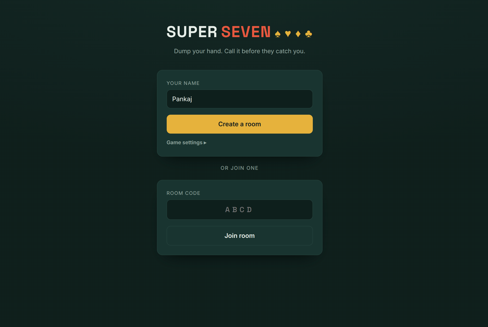
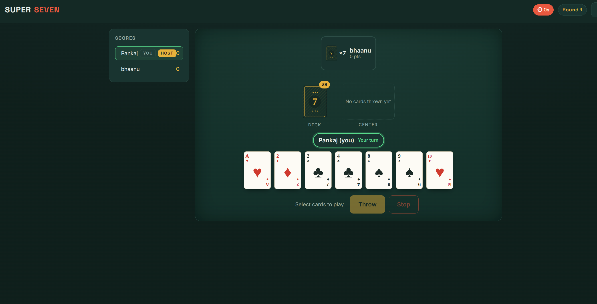

# 🃏 Super Seven

A fast-paced real-time multiplayer card game built with **Flask-SocketIO** and **vanilla JS**. Shed the points in your hand, call **Stop** when you think you're lowest, and survive the elimination cap.

---

### 🚀 Play it Live

[](https://super-seven.onrender.com)

> **💡 Feedback welcome!** If you find a bug or have a feature idea, open an **Issue** — the game is actively evolving.

---

## 📸 Gameplay Preview

| Welcome Lobby | Live Game Session |
| :---: | :---: |
|  |  |

---
## 📖 The Official Rule Book

### 🎯 1. Game Objective
The goal is to shed the points in your hand. When you believe your remaining cards have a lower total value than every other active opponent, call **Stop** to end the round. If your cumulative score across multiple rounds exceeds the score cap, you are eliminated. The last player standing wins!

### 🃏 2. Card Values & Deck
In Super Seven, **suits do not matter**. Only the rank of the card is used for gameplay and scoring.
| Card | Point Value |
|---|---|
| **Ace** | 1 (Ace is strictly low) |
| **2 – 10** | Face value |
| **Jack** | 11 |
| **Queen** | 12 |
| **King** | 13 |

### 📜 3. General Game Rules
- Every player is dealt **7 cards** at the start of a round.
- Turns proceed in order. You have a **40-second timer** to make your move, or the game will auto-play for you.
- Three consecutive timeouts will result in you being kicked from the game.

### 🖐️ 4. Player Options on a Turn
When it is your turn, you must select one of the following actions. (No-draw actions are always highly strategic!)

- **Single Discard:** Throw any 1 card, then **draw 1 card** from the deck.
- **Pair:** Throw 2 cards of the *exact same rank*, then **draw 1 card** from the deck.
- **Set (No Draw):** Throw 3 or 4 cards of the *exact same rank*. You do **not** need to draw a card.
- **Sequence (No Draw):** Throw 3 or more cards in a consecutive run (e.g., 3-4-5). Ace is strictly low (A-2-3 is valid, but Q-K-A is not). You do **not** need to draw a card.
- **Match (Free Play):** You may throw any cards that *match* the rank of the cards currently visible in the center pile from the previous player's throw. You can match *any* previous throw (even a single card). You do **not** need to draw a card. *(Note: This behavior is configurable in `config.py` via `MATCH_REQUIRES_DRAW`).*

### 🛡️ 5. Going Safe (The Zero-Point Zone)
If you manage to empty your hand entirely using a Set, Sequence, or Match, your round score locks at **0 points**. You are now completely **Safe** and sit out for the remainder of the round. 

### 🛑 6. Calling Stop (Ending the Round)
You can call **Stop** to immediately end the round, but it comes with strict conditions:
- **Timing:** You can *only* call Stop at the **start** of your turn, and you **cannot** call it during the very first orbit of the round (everyone must have played at least once).
- **Winning:** To successfully call Stop, your hand total must be **strictly lower** than the hand totals of all other *active* players. If successful, you win the round and receive a score discount (default: -5 points).
- **The Trap (Penalty):** If any active player ties or beats your hand total, you are **caught**. You will absorb your hand total *plus* a heavy penalty (default: +40 points).
- **The Safe Player Exemption:** Players who are **Safe (0 points)** are completely ignored when determining if a Stop caller wins or gets caught. You only compete against players who are still holding cards!

### ☠️ 7. Elimination & Winning the Game
Round scores accumulate over time. Once your cumulative total crosses the **Score Cap (default: 100 points)**, you are eliminated. If multiple players cross the cap on the same round, the one with the lowest total score survives. The last player standing wins the entire game.

---

## ✨ Features

- **Real-time multiplayer** — WebSocket-powered with Flask-SocketIO, all actions sync instantly across all players
- **Complete game loop** — lobby, dealing, turn play, drawing, Stop with first-orbit gating, round scoring, and multi-round rotation
- **Smart turn engine** — supports single discard, set, sequence, and match plays with full server-side validation
- **Scoring system** — win discount for correct Stop calls, caught penalty for wrong ones, safe/trap rule enforcement
- **Automatic turn timer** — 40-second timer per turn with auto-play; a player is removed after three consecutive timeouts
- **Elimination & tiebreaker** — players eliminated at the score cap; survivor tiebreaker when multiple players hit it simultaneously
- **Reconnection support** — players rejoin seamlessly at any stage using stable client-generated identities
- **Host migration** — if the host disconnects, another player automatically takes over
- **Custom card faces** — all card SVGs are generated in-house, not a third-party pack

---

## 🏗️ Project Structure

```
super_seven_cards/
├── app.py                  # Flask + SocketIO entrypoint
├── config.py               # Environment variables and tunable constants
├── game/                   # Pure domain logic (networking-free)
│   ├── cards.py            # Card definitions and deck management
│   └── player.py           # Player profiles and identity tracking
├── sockets/                # WebSocket event handlers
│   ├── common.py           # Shared payload helpers
│   └── connection.py       # Connect / disconnect handling
├── static/
│   ├── css/style.css       # UI styles
│   ├── js/                 # Modular frontend (game, lobby, socket, table)
│   └── img/cards/          # Generated SVG card faces
├── templates/              # Jinja2 views (index + game)
├── tools/
│   └── generate_cards.py   # SVG card face generator
├── Procfile                # Gunicorn startup command
├── render.yaml             # Render Blueprint deployment spec
└── requirements.txt        # Python dependencies
```

---

## 🛠️ Quick Start (Local)

Requires Python 3.10+ (3.12 recommended).

```bash
# 1. Clone and enter the repo
git clone https://github.com/PankajChauhanji/SuperSevenCards.git
cd SuperSevenCards

# 2. Create a virtual environment
python -m venv venv
source venv/bin/activate        # Windows: venv\Scripts\activate

# 3. Install dependencies
pip install -r requirements.txt

# 4. Start the server
python app.py
```

Open **http://localhost:5000**. To test multiplayer solo, open a second browser window in **Incognito** — it generates a separate player identity. Create a room, share the 4-letter code, and start.

---

## ⚙️ Environment Variables

| Variable | Purpose | Default |
|---|---|---|
| `SECRET_KEY` | Flask session secret — override in production | `dev placeholder` |
| `CORS_ORIGINS` | Socket.IO allowed origins | `*` |
| `PORT` | Port to bind | `5000` |
| `FLASK_DEBUG` | Enable hot reload (`1` to enable) | `0` |

---

## 🌐 Deployment

Super Seven is a stateful WebSocket app with in-memory room state — always run **exactly one worker**:

```bash
gunicorn --worker-class eventlet -w 1 --bind 0.0.0.0:$PORT app:app
```

A `render.yaml` blueprint is included for one-click deploys on Render. Railway and Fly.io work equally well.

> ⚠️ **Never use multiple workers.** Room state lives in memory — multiple workers split players across isolated processes and break the game.

---

## 🃏 Regenerating Card SVGs

All card faces are custom generated SVGs — no third-party image packs. Regenerate any time:

```bash
python tools/generate_cards.py    # writes to static/img/cards/*.svg
```

---

## 🧩 Architecture

```
Browser (vanilla JS + Socket.IO client)
              ↕  WebSockets
Flask-SocketIO (single-process, eventlet)
              ↕
In-memory game engine (room / player / rules / scoring)
```

- **Domain layer** (`game/`) is completely decoupled from networking — pure Python logic, easy to unit test
- **Socket layer** (`sockets/`) handles all real-time events and delegates to the domain layer
- **Client identities** are stable and client-generated — survives page refreshes and reconnections mid-game

---

## 🔍 Troubleshooting

**Players end up in empty isolated rooms**
Your server is running more than one worker. Enforce `-w 1` in your Gunicorn command.

**Cold start delay on first load**
Render's free tier sleeps after 15 minutes of inactivity. The first visitor after a sleep window waits ~1 minute for the instance to wake up.

**Gunicorn version issues**
The project pins `gunicorn==23.0.0`. Versions 26+ removed bundled eventlet support and cause startup errors if upgraded blindly.

---

## 📄 License

Copyright (c) 2024 PankajChauhanji. All Rights Reserved.

Viewing of this source code is permitted for reference purposes only. Copying, modification, distribution, or use of this code in any form is strictly prohibited without explicit written permission from the author.